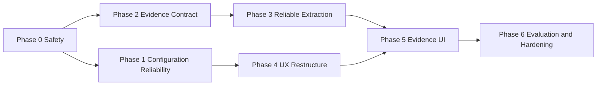

# Implementation Plan: Configuration UX and Evidence-Based AI

Last updated: June 11, 2026

## Objective

Improve configuration reliability and accessibility while changing the meeting intelligence pipeline from best-effort generated text into evidence-backed structured output.

## Delivery Strategy

Implement in phases so correctness fixes land before larger schema and UX changes.

Approved delivery model:

- Ship as independently releasable milestones.
- Each milestone must preserve compatibility and pass its own release gates.
- Do not hold immediate safety fixes for the complete redesign.

## Phase 0: Immediate Safety Fixes

### 0.1 Explicit transcription result contract

Files:

- `src-python/transcription_service.py`
- `src-python/main.py`
- `src-python/tests/test_transcription_service.py`
- `src-python/tests/test_integration.py`

Tasks:

- Add `ok`, `error`, `warnings`, `segments`, and `text` fields.
- Stop encoding errors inside `text`.
- Prevent summary generation when transcription fails.
- Prevent failed transcripts from being saved or indexed.
- Emit a structured failure event to the frontend.

Acceptance criteria:

- A transcription failure cannot create a meeting summary.
- A transcription failure cannot create a RAG entry.
- The UI receives a recoverable error with a stable error code.
- Tests cover model-load, file, alignment, and transcription failures.

### 0.2 Provider credential isolation

Files:

- `src/app/providers/SettingsProvider.tsx`
- `src/widgets/PopoverWidget.tsx`
- related frontend tests

Tasks:

- Load the selected provider's secret when provider selection changes.
- Never carry a visible key from one provider to another.
- Track whether a replacement credential has been validated.
- Save provider and credential atomically from the user's perspective.

Acceptance criteria:

- Switching OpenAI to Anthropic cannot save the OpenAI key as an Anthropic key.
- Switching back restores the correct provider-specific secret state.
- Tests cover provider switching before and after edits.

### 0.3 Safe settings persistence

Files:

- `src/widgets/PopoverWidget.tsx`
- settings tests

Tasks:

- Add dirty-state tracking.
- Disable blur-close while dirty or saving.
- Add pending, success, and failure states.
- Keep the window open when save fails.
- Add discard confirmation for explicit close.

Acceptance criteria:

- Unsaved changes are not lost through focus changes.
- Save failures retain user input.
- Double-save is prevented.

## Phase 1: Validation and Configuration Reliability

### 1.1 Pyannote model-access validation

Files:

- `src/features/onboarding/steps/HuggingFaceSetup.tsx`
- tests
- optional Rust/Python validation command if browser HTTP cannot reliably test gated access

Tasks:

- Verify token identity.
- Verify access to the required Pyannote model resource.
- Distinguish terms rejection, invalid token, rate limit, and network failure.
- Enable diarization only after model access succeeds.

Acceptance criteria:

- A valid token without accepted model terms is not reported as ready.
- The UI provides an `Open model page` recovery action.
- Re-check succeeds without re-entering the token.

### 1.2 Cloud validation consistency

Files:

- `src/features/onboarding/steps/CloudValidation.tsx`
- tests

Tasks:

- Normalize pasted keys.
- Map authentication, authorization, rate-limit, network, and service failures separately.
- Use provider-specific button labels and help links.
- Associate validation messages with their inputs.

### 1.3 Ollama recovery

Files:

- `src/features/onboarding/steps/OllamaSetup.tsx`
- tests

Tasks:

- Replace `alert()` with an inline recovery panel.
- Add retry and choose-model actions.
- Display estimated disk requirement.
- Use semantic progress reporting.
- Handle interrupted downloads.

## Phase 2: Evidence and Schema Foundation

### 2.1 Define versioned meeting intelligence schemas

New or modified files:

- `src-python/schemas.py`
- `src-python/transcription_service.py`
- `src/features/summary/types.ts`
- shared IPC type definitions

Schemas:

- `TranscriptionResult`
- `TranscriptSegment`
- `TranscriptWord`
- `Decision`
- `ActionItem`
- `MeetingSummary`
- `PipelineWarning`

Required fields:

- Schema version
- Segment IDs
- Timestamps
- Speaker IDs
- Evidence references
- Confidence
- Inference flag
- Nullable unknown fields

### 2.2 Database migration

Files:

- `src-tauri/src/lib.rs`
- Rust database tests

Tasks:

- Preserve existing `raw_transcript` and `structured_summary`.
- Add storage for versioned transcript segments and schema version.
- Add migration support for existing meetings.
- Continue rendering legacy meetings.

Decision required:

- Store structured transcript segments as JSON in SQLite initially, or normalize them into separate relational tables.

Approved choice:

- Use versioned JSON columns initially.
- This keeps transcript evidence atomic, supports schema evolution, and avoids a large relational migration.
- Add indexes only for fields that need database-level querying.
- Reconsider normalized tables if transcript-level analytics or partial segment updates become core requirements.

### 2.3 IPC compatibility

Tasks:

- Add schema version to Python events.
- Keep a temporary compatibility adapter for existing frontend hooks.
- Reject unsupported future schema versions explicitly.

## Phase 3: Reliable AI Pipeline

### 3.1 Preserve timestamped transcription

Files:

- `src-python/transcription_service.py`
- tests

Tasks:

- Return aligned segments even when diarization is disabled.
- Preserve word timestamps where available.
- Return alignment and diarization warnings explicitly.
- Add language and confidence metadata.
- Use configured transcription model/profile.

### 3.2 Evidence-first extraction

Files:

- `src-python/llm_service.py`
- `src-python/schemas.py`
- tests

Tasks:

- Extract actions and decisions from immutable raw segments.
- Require evidence IDs and quotes.
- Verify evidence quotes against source text.
- Keep unknown owner, due date, rationale, and priority as `null`.
- Permit inference when useful, but mark it explicitly and attach a confidence score.
- Do not present inferred and directly supported values with the same visual treatment.

### 3.3 Typed structured output

Tasks:

- Validate output with Pydantic.
- Prefer provider-native structured output where supported.
- Add one repair retry using validation errors.
- Emit a partial-result warning rather than silently returning empty arrays.
- Separate extraction and narrative temperatures.

### 3.4 Long-meeting chunking

Tasks:

- Implement token-aware chunks on segment boundaries.
- Preserve time ranges and speaker turns.
- Add overlap.
- Extract candidates per chunk.
- Deduplicate and reconcile globally.
- Detect conflicting decisions or assignments.

### 3.5 Summary generation

Generate the narrative only from verified entities, decisions, actions, risks, and questions.

Recommended sections:

- Outcome
- Key points
- Decisions
- Action items
- Risks and blockers
- Open questions
- Unresolved topics

## Phase 4: Onboarding and Settings UX

### 4.1 Shared configuration components

Create reusable components for:

- Wizard footer
- Form field
- Validation status
- Connection card
- Radio card
- Inline error/recovery panel
- Progress indicator

Goal:

- Remove duplicated inline CSS and inconsistent validation behavior.

### 4.2 Onboarding restructure

Recommended steps:

1. AI processing choice
2. Provider/model setup
3. Audio test
4. Optional speaker identification
5. Review and finish

Tasks:

- Add step count and names.
- Add final review.
- Use one primary action per state.
- Explain local/cloud privacy behavior.
- Preserve entered values when navigating backward.

### 4.3 Accessibility

Tasks:

- Convert selection cards to radio controls.
- Connect labels and inputs.
- Add live regions.
- Add full keyboard tab behavior.
- Add focus management between steps.
- Test at 200% zoom and keyboard-only.

### 4.4 Settings information architecture

Sections:

- General
- Audio
- AI and Models
- Integrations
- Privacy and Data
- Advanced

Tasks:

- Move diagnostic and destructive actions into Advanced.
- Move Notion and future connections into Integrations.
- Move RAG retention and indexing controls into Privacy and Data.

## Phase 5: Evidence-Aware Meeting UI

Files:

- `src/features/summary/components/SummaryDashboard.tsx`
- transcription components and hooks
- meeting detail components

Tasks:

- Add `View in transcript` to decisions and action items.
- Seek or scroll to the evidence segment.
- Display confidence for extracted and inferred claims.
- Prefer understandable confidence labels with optional numeric detail:
  - High: `>= 0.85`
  - Medium: `>= 0.60`
  - Low: `< 0.60`
- Label inferred values.
- Allow speaker renaming.
- Persist action-item completion state.
- Render warnings for incomplete alignment or diarization.

Acceptance criteria:

- Every displayed decision and action can reveal its supporting source.
- Unsupported or inferred information is visually distinguishable.
- Legacy meetings continue to render.

## Phase 6: Evaluation, Privacy, and Release Gates

### 6.1 Quality evaluation dataset

Use a mixed public and internal benchmark because no single dataset covers audio, diarization, summaries, action items, evidence, and Portuguese.

#### Public datasets

| Dataset | Primary use | Initial sample | License consideration |
|---|---|---:|---|
| AMI Meeting Corpus | End-to-end audio, transcription, timestamps, and diarization | 10 meetings | CC BY 4.0; attribution required |
| QMSum | Whole-meeting summaries, query summaries, and relevant evidence spans | 30 meetings | MIT repository; preserve source attribution |
| CORAA | Brazilian Portuguese transcription and spontaneous speech | 10 audio samples | CC BY-NC-ND 4.0; benchmark use only unless reviewed |
| MeetingBank | Very long meetings and professionally written minutes | Optional 5 meetings | Restrictive/non-commercial; not a required commercial-release fixture |
| PublicHearingBR | Portuguese long-document summary and factuality testing | Optional 10 transcripts | Verify dataset terms before redistribution |

Do not commit large public audio files to the repository. Add preparation scripts and a manifest containing dataset version, source URL, checksum, license, and selected fixture IDs.

#### Internal Portuguese benchmark

Create at least 10 consented Portuguese meeting fixtures representing the real product and covering:

- English and Portuguese
- Code switching
- Noise and overlapping speech
- Technical terminology
- Short and long meetings
- Ambiguous action items

Each fixture must include:

- Original audio
- Verbatim reference transcript
- Speaker and timestamp annotations
- Participant and project glossary
- Human-written summary
- Decisions with evidence segments
- Action items with assignee, due date, and evidence
- Open questions, risks, and unresolved topics
- Consent and permitted-use metadata

Keep private benchmark media outside the Git repository. The repository should contain only synthetic or explicitly approved distributable fixtures.

### 6.2 Metrics

#### Overall quality score

Use a weighted score from 0 to 100:

| Category | Weight |
|---|---:|
| Transcription quality | 25% |
| Speaker attribution | 15% |
| Summary factuality and coverage | 30% |
| Decisions and action items | 20% |
| Robustness and performance | 10% |

#### Automated metrics

- WER
- Character error rate
- Named-entity error rate
- Diarization error rate
- Speaker-attributed WER
- Speaker count accuracy
- Action and decision precision/recall
- Assignee and due-date accuracy
- Evidence quote validity
- Entailment
- Summary coverage and factuality
- Hallucination rate
- Long-meeting omission rate
- Confirmed versus inferred classification accuracy
- Confidence calibration
- Latency, memory, VRAM, provider cost, and failure rate

ROUGE and BERTScore are secondary comparison metrics. They must not replace factuality, evidence, or human evaluation.

### 6.3 Benchmark harness

New files or modules:

- `benchmarks/README.md`
- `benchmarks/manifest.json`
- `benchmarks/config.yaml`
- `benchmarks/scripts/prepare_ami.py`
- `benchmarks/scripts/prepare_qmsum.py`
- `benchmarks/scripts/prepare_coraa.py`
- `benchmarks/run_benchmark.py`
- `benchmarks/scorers/`
- `benchmarks/reports/` in `.gitignore`

Harness requirements:

- Run transcription-only, summary-only, and end-to-end modes.
- Pin dataset fixture IDs and checksums.
- Record application commit, schema version, model versions, provider, prompts, and inference settings.
- Cache model outputs to avoid accidental repeated cloud costs.
- Generate JSON and Markdown reports.
- Compare results with a checked-in baseline.
- Fail CI when a protected metric regresses beyond its tolerance.
- Support private benchmark paths through environment variables.

### 6.4 Human evaluation

For every release candidate:

- Two reviewers independently score at least 10 meetings.
- Use a 1-5 rubric for factuality, completeness, usefulness, organization, and actionability.
- Reviewers mark unsupported statements and missing critical commitments.
- Substantial disagreements require adjudication.
- Store only ratings and approved excerpts in the repository.

### 6.5 Baseline and release thresholds

The first benchmark run establishes the current baseline before quality refactoring.

Initial non-regression gates:

- No transcription WER increase greater than 1 absolute percentage point.
- No action-item precision decrease greater than 3 percentage points.
- Evidence quote validity remains at or above 99%.
- Failed-transcription persistence rate is 0%.
- Pipeline completion rate remains at or above 98%.
- Hallucination rate does not increase.

Target gates for the evidence-based pipeline:

- Evidence quote validity: `>= 99%`
- Decision precision: `>= 90%`
- Action-item precision: `>= 90%`
- Assignee accuracy on explicit assignments: `>= 90%`
- Hallucination rate on critical claims: `< 2%`
- Pipeline completion rate: `>= 98%`
- Human factuality score: `>= 4.3 / 5`
- Human usefulness score: `>= 4.0 / 5`

Set WER and diarization targets after measuring separate baselines for AMI, CORAA, and the internal Portuguese set. Do not combine them into one threshold because their difficulty differs.

### 6.6 Privacy controls

Tasks:

- Add retention settings.
- Add per-meeting RAG exclusion.
- Document local and cloud data flow.
- Redact secrets from logs.
- Encrypt local meeting content as part of this program.
- Use an OS-keychain-protected encryption key rather than a key stored beside the database.
- Plan migration, backup, recovery, and key-loss behavior before enabling encryption by default.
- Avoid claiming full-database encryption until the selected SQLite encryption implementation is packaged and validated on every platform.

### 6.7 Release gates

- No failed transcription can be persisted.
- Evidence validity reaches the agreed threshold.
- Benchmark reports identify exact dataset and model versions.
- Protected quality metrics do not regress from the approved baseline.
- Human evaluation satisfies the release thresholds.
- Provider credential-switch tests pass.
- Keyboard-only onboarding passes.
- Settings cannot lose dirty state.
- Windows packaged sidecar passes preflight.
- macOS and Linux pass platform validation.

## Suggested Work Packages

### Package A: Safety

- Phase 0.1
- Phase 0.2
- Phase 0.3

### Package B: Configuration reliability

- Phase 1

### Package C: Evidence contract

- Phase 2
- Phase 3.1

### Package D: Reliable intelligence

- Phase 3.2 through 3.5

### Package E: Product experience

- Phase 4
- Phase 5

### Package F: Evaluation and release

- Phase 6

## Test Strategy

### Frontend

- Provider switching and secret isolation
- Save failure and dirty close
- Keyboard-only onboarding
- Accessible labels and live regions
- Hugging Face gated-access states
- Evidence navigation
- Legacy summary rendering

### Python

- Explicit transcription failures
- Segment and word timestamp preservation
- Schema validation and repair
- Evidence quote verification
- Unknown-field behavior
- Long-meeting chunk boundaries and reconciliation

### Rust

- Schema migration idempotency
- Legacy meeting compatibility
- New JSON field persistence
- Secret commands and provider isolation

### End-to-end

- Real recording to evidence-backed summary
- Failed recording recovery
- Local Ollama pipeline
- At least one cloud-provider pipeline with test credentials in protected CI
- Diarization with accepted gated-model access

## Product Decisions

1. AI may infer owners, deadlines, priorities, and rationale when the result is labeled as inferred and includes confidence.
2. Transcript evidence will initially use versioned JSON columns.
3. Settings will use explicit `Save changes` behavior consistently. Credential and multi-field configuration changes will never auto-save.
4. Confidence will be visible in the meeting UI using labels with optional numeric detail.
5. Local meeting-content encryption is included in the implementation program.
6. Delivery will use independently releasable milestones.

## Milestone Sequence

### Milestone 1: Safety and configuration integrity

- Explicit transcription failures
- Provider credential isolation
- Dirty-state and reliable settings save
- Pyannote model-access validation
- Cloud and Ollama recovery improvements

Release outcome:

- Existing architecture remains intact, but dangerous failure and configuration paths are closed.

### Milestone 2: Evidence data foundation

- Versioned Python and TypeScript schemas
- Timestamped transcript segments
- SQLite JSON migration
- IPC compatibility adapter
- Legacy meeting support

Release outcome:

- The app stores evidence without requiring the new summary pipeline or UI.

### Milestone 3: Reliable meeting intelligence

- Evidence-first extraction
- Typed structured output
- Confidence and inference metadata
- Token-aware long-meeting processing
- Verified summary generation

Release outcome:

- New meetings produce evidence-backed decisions and actions.

### Milestone 4: Product experience

- Onboarding redesign
- Settings information architecture
- Accessibility
- Evidence navigation
- Speaker renaming
- Persistent action completion

Release outcome:

- Users can understand configuration and verify AI claims.

### Milestone 5: Privacy and quality gates

- Retention and RAG controls
- Local meeting-content encryption
- Evaluation dataset and metrics
- Cross-platform packaging and migration tests

Release outcome:

- Privacy and measured quality become enforced release properties.

## Definition of Done

- Functional changes include automated regression coverage.
- User-facing failures provide a recovery action.
- AI claims preserve source evidence.
- Unknown and inferred values are distinguishable.
- Existing meetings and settings migrate without data loss.
- Documentation reflects final product behavior.
